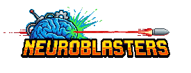

# NeuroBlasters 🎮

**A multiplayer 2D top-down tank shooter with AI-powered bots**

*Authors: Marcin Rolbiecki, Mateusz Kasprzak, Kacper Grzybowski*



---

## 📖 Overview

NeuroBlasters is a fast-paced, team-based multiplayer tank shooter built in Rust. Players control tanks in top-down arenas, battling in intense team deathmatches. The game features a client-server architecture with support for multiple concurrent games and AI-powered bots that can be trained using reinforcement learning.

### Key Features

- **🌐 Multiplayer Gameplay**: Client-server architecture supporting multiple concurrent games
- **⚔️ Team Deathmatch**: Red vs Blue team battles with round-based gameplay
- **🤖 AI Bots**: Neural network-powered bots with pathfinding and combat capabilities
- **🗺️ Multiple Maps**: Play on different arena layouts
- **🎯 Real-time Combat**: Physics-based movement, projectile shooting, and collision detection
- **🏆 Round System**: Best-of-N rounds with score tracking and win conditions

---

## 🏗️ Architecture

The project is organized as a Rust workspace with three main crates:

### **Server** (`code/server`)
- Concurrent game server handling multiple lobbies
- ~60Hz tick rate for smooth gameplay
- Game state management and robust error handling
- Client connection handling via `renet` networking library

### **Client** (`code/client`)
- Cross-platform game client built with `macroquad`
- Real-time rendering and input handling
- UI system with menus, lobbies, and in-game HUD

### **Common** (`code/common`)
- Shared game logic and data structures
- Network protocol definitions
- Physics engine (collision detection, projectile mechanics)
- AI and reinforcement learning modules

---

## 🎮 How to Play

### Prerequisites

- **Rust**: Version 1.92 (specified in `rust-toolchain.toml`)
- **Assets**: Logo files in `assets/` directory (required for client)

### Starting the Server

1. Navigate to the project root:
   ```bash
   cd /path/to/NeuroBlasters
   ```

2. Run the server:
   ```bash
   cargo run --bin server
   ```

   The server will start listening on the default port and display connection information.

   **Optional**: Set logging level for detailed output:
   ```bash
   RUST_LOG=debug cargo run --bin server
   ```

### Starting the Client

1. In a new terminal, run the client:
   ```bash
   cargo run --bin client
   ```

2. The game window will open with the main menu.

### Gameplay Instructions

0. First, choose "Multiplayer" from the main menu and connect to the server. You can specify the server address here. For tests, "localhost" will work.

#### **Creating a Game**

1. From the main menu, select **"Create Game"**
2. Choose your settings:
   - **Map**: Select from available maps (Basic, Loss)
   - **Rounds**: Set the number of rounds (best-of-N)
3. Click **"Create"** to start a lobby
4. After clicking Escape, you can see the game code. Share it with other players.
5. Wait for players to join, then click **"Start Game"** when ready.

#### **Joining a Game**

1. From the main menu, select **"Join Game"**
2. Enter the **game code** provided by the host
3. Click **"Join"** to enter the lobby
4. Wait for the host to start the game

#### **Controls**

- **Movement**: `W` `A` `S` `D` keys
- **Aim**: Mouse cursor
- **Shoot**: Left mouse button
- **Menu**: `ESC` key

#### **Game Modes**

**Team Deathmatch**
- Two teams: Red vs Blue
- Eliminate all enemy players to win a round
- First team to win the majority of rounds wins the match
- Round timer: 100 seconds (team with most HP wins if time expires)

---

## 🛠️ Technical Details

### Network Protocol

- **Transport**: UDP with `renet` and `renet_netcode`
- **Serialization**: `bincode` for efficient binary encoding
- **API Version**: 8 (client-server compatibility check)

### Game Physics

- **Tick Rate**: ~60 Hz (16.666ms per tick)
- **Projectile Speed**: 500 units/second
- **Fire Rate**: 0.2 seconds between shots
- **Collision Detection**: Circle-rectangle and circle-circle algorithms
- **Wall Collision**: AABB (Axis-Aligned Bounding Box) resolution

### AI System

The game includes AI bots with:
- **Pathfinding**: A* algorithm for navigation around obstacles
- **Combat AI**: Targeting and shooting logic
- **Reinforcement Learning**: Neural network models (using `burn` ML framework)
- **Feature Extraction**: Game state representation for ML training

---

## 🧪 Development

### Building

```bash
# Build all crates
cargo build

# Build in release mode for better performance
cargo build --release
```

### Running Tests

```bash
# Run all tests
cargo test

# Run tests for a specific crate
cargo test -p server
cargo test -p client
cargo test -p common
```

### Project Structure

```
NeuroBlasters/
├── assets/              # Game assets (logos, fonts)
├── code/
│   ├── server/         # Server implementation
│   ├── client/         # Client implementation
│   └── common/         # Shared game logic
├── Cargo.toml          # Workspace configuration
└── README.md           # This file
```

---

## 🎯 Future Enhancements

- **AI Training Mode**: Offline training simulation for custom bots
- **More Game Modes**: Capture the flag, free-for-all
- **Additional Maps**: More arena layouts with varied obstacles
- **Grenade Mechanics**: Throwable explosives
- **Enhanced VFX**: Particle effects and animations
- **Bring-Your-Own-AI**: Use custom-trained AI in multiplayer matches

## AI notes
- **AI-trainer**: UI does not support the AI training for now (only plaing against it or spectating). You can train the AI with RL algorithm using the trainer.
- **RL**: There are example bots (971-1000.bin are last 30 generations of the RL I was training for a few hours)
- **Multiplayer**: For now RL is not supported in multiplayer games - only in local trainer mode.
- **Notice that GPU-acceleration is needed for any RL-related stuff!!**

---

**Enjoy the game! 🚀**
