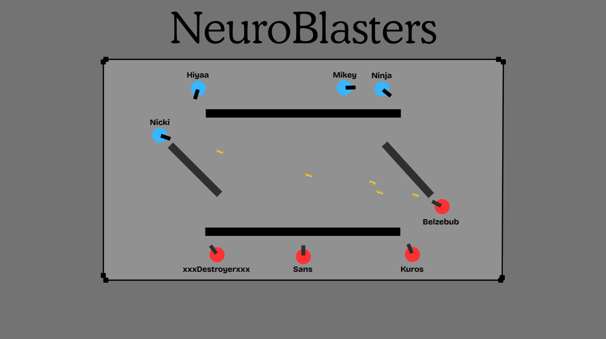

# Rust big project proposal
by Kacper Grzybowski, Marcin Rolbiecki, Mateusz Kasprzak

## NeuroBlasters
**A mutliplayer 2D top-down shooter where the AI evolves each round.**

### Expected features:
- a multiplayer game in the server-client model with a concurrent server handling multiple games at once,
- 2D, top-down scenery with a few simple maps to choose (like one shown above),
- players can move around, rotate the gun, and shoot projectiles,
- main game mode is a team deathmatch with a fixed-size team and remaining slots filled by AI,
- player can train their own AI in an offline session, watching each epoch become smarter and smarter, and with the option to tweak certain ML parameters,
- a UI to navigate all those features.

### Technologies used:
- macroquad - light-weight game engine with just enough features and cross-platform support
- renet - a network library that will help developing the client-server API
- burn - lightweight Rust ML framework for experimenting with simple neural-network-based bot training
### First iteration:
Full game with only a mockup of an AI (moves around randomly)
### Second iteration:
Pre-trained AI available to play against, offline AI training simulation fully functional
### Additional:
- grenade throwing, 
- more game modes, 
- SFX and VFX, 
- training AI and then using it against other players in a match (bring-your-own-AI)

